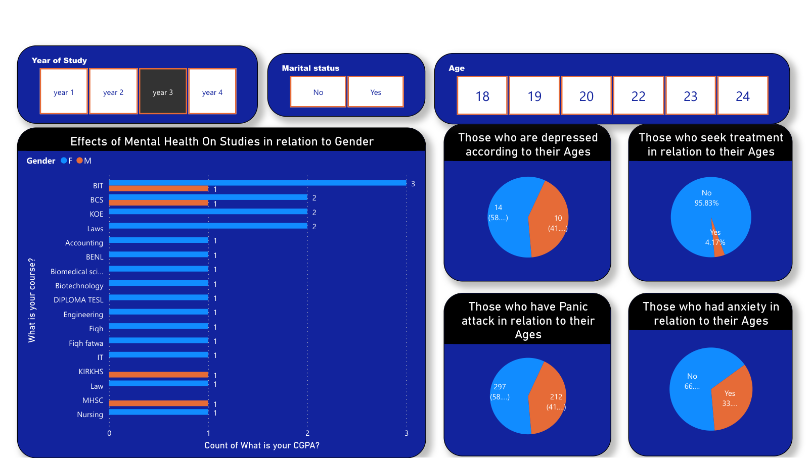

# Effects of Mental Health on Studies (Power BI)

A dashboard built from a university student mental-health survey. It looks at depression, anxiety, panic attacks and whether students seek treatment, broken down by age, course, year of study and marital status.

## What it shows
- **CGPA by course and gender:** where academic performance and gender overlap
- **Prevalence by age:** depression, anxiety and panic attacks
- **Treatment gap:** the share of students with symptoms who seek treatment (very low in the filtered view)
- **Slicers:** year of study, marital status and age, to compare cohorts

**Tools:** Power BI Desktop
**Files:** [`.pbix`](EFFECTS%20OF%20MENTAL%20HEALTH%20ON%20STUDIES.pbix) (open in Power BI Desktop) · [`.pdf`](EFFECTS%20OF%20MENTAL%20HEALTH%20ON%20STUDIES.pdf)
